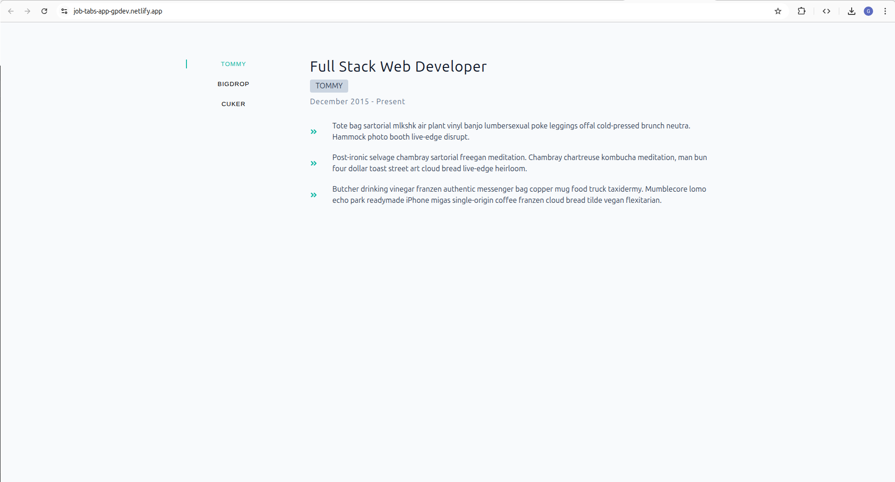
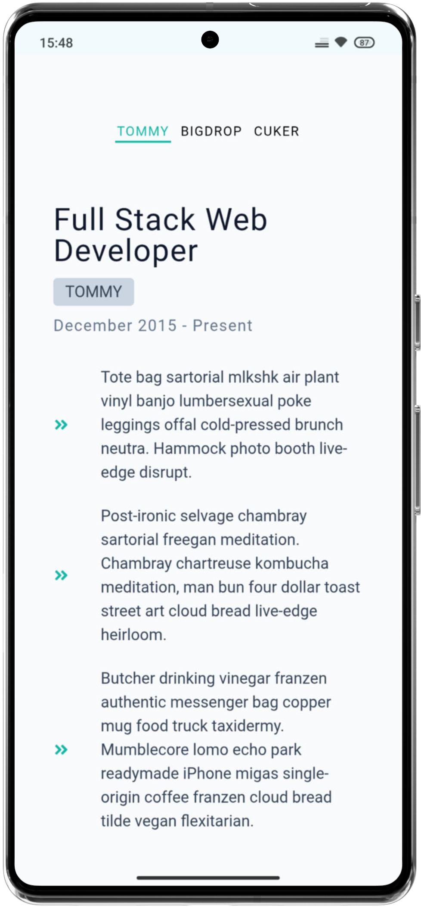

# Job-Tabs-App 📄


A React practice project featuring dynamic job information displayed through interactive tabs. Built to practice API data fetching, state management, and component composition in React.

## 📸 Project Preview

<table>
  <!-- Row for Desktop -->
  <tr>
    <td align="center"><strong>💻 Desktop Experience</strong></td>
  </tr>
  <tr>
    <td align="center"></td>
  </tr>
  <tr>
    <td align="center"><em>Full-width layout with side tabs and detailed job description</em></td>
  </tr>
  
  <!-- Row for Mobile -->
  <tr>
    <td align="center"><strong>📱 Mobile Experience</strong></td>
  </tr>
  <tr>
    <td align="center"></td>
  </tr>
  <tr>
    <td align="center"><em>Stacked layout with horizontal tab navigation</em></td>
  </tr>
</table>

## ✨ Features

- **Tab Navigation** - Interactive tabs for switching between different job positions
- **API Data Fetching** - Dynamic data retrieval from external API
- **Responsive Design** - Adapts to different screen sizes
- **Loading States** - Elegant loading spinner during data fetch
- **Component Architecture** - Well-structured component hierarchy

## 💡 Key Learnings / Implemented Concepts

This project was created to practice essential React concepts:

- **API Integration** - Using `fetch API` with `useEffect` for data retrieval
- **State Management** - Implementing useState for jobs data and current item tracking
- **Component Communication** - Passing data and functions between components via props
- **Dynamic Rendering** - Displaying content based on current tab selection
- **List Rendering** - Using `map()` with unique keys for duties and buttons
- **Conditional Styling** - Active state styling for selected tabs
- **Error Handling** - Try-catch blocks for API error management
- **UUID Implementation** - Generating unique keys for dynamic content

## 🧰 Built With

- Vite + React
- JavaScript (ES6+)
- React Icons
- UUID Library
- HTML5 & CSS3

## ▶️ Live Demo

**View Live on Netlify:**
[Click here](https://job-tabs-app-gpdev.netlify.app/)

## 🎨 Design

Figma design provided by the course instructor:[ Preview here](https://www.figma.com/design/FJC19b9eUWS62HKR8L9Dmn/Tabs?node-id=0-1&p=f&t=B3Uz6u8bSBdbB8SA-0)

## 📦 Getting Started

### Prerequisites

- **Node.js ≥ 18**
- **npm or yarn**

### Installation

1. Clone the repository

```bash
git clone https://github.com/pro804/Job-Tabs-App.git
```

2. Navigate to the project directory

```bash
cd Job-Tabs-App
```

3. Install dependencies

```bash
npm install
```

4. Start the development server

```bash
npm run dev
```

5. Open http://localhost:5173 to view it in the browser.

## 🔧 Scripts

- `npm run dev` — Runs the development server (Vite)
- `npm run build` — Builds the app for production
- `npm run preview` — Previews the production build locally

## 📄 License

This project is created for educational purposes as part of a React learning journey.
